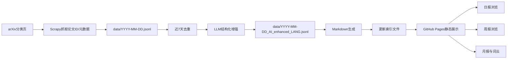

# 学术论文跟踪助手（daily-arXiv-ai-enhanced）中期答辩材料

> 项目定位：基于 **GitHub Actions + GitHub Pages + LLM** 的 arXiv 自动追踪与智能解读系统。

---

## 1. 我们做了什么（对照开题目标）

### 1.1 开题目标（摘要）
- 解决论文信息过载
- 打通“每日推送、每周摘要、每月综述”
- 实现“追踪-存储-大模型调用-展示”自动化链路

### 1.2 中期已完成
- ✅ 日报主链路：抓取 -> 去重 -> LLM结构化增强 -> Markdown生成 -> Pages展示
- ✅ 周报链路：Map-Reduce主题提取与趋势总结
- ✅ 前端可用页面：日期筛选、分类过滤、关键词/作者偏好、报告浏览
- ✅ 自动化调度：日/周/月 GitHub Actions 工作流
- ✅ 月报与词云能力已具备初版（作为中期扩展项）

### 1.3 中期仍需补强
- ⏳ 评测闭环（质量指标、人工抽样）
- ⏳ 成本与稳定性量化（失败率、耗时、token消耗）
- ⏳ 多学科扩展的系统化验证

---

## 2. 项目运作机理（核心流程）

### 2.1 模块分工（仓库可验证）
- `daily_arxiv/`：抓取与去重
- `ai/enhance.py`：结构化摘要增强（TL;DR、Motivation、Method、Result、Conclusion）
- `ai/weekly_summary.py`：周报 Map-Reduce
- `ai/monthly_summary.py`：月报趋势分析与词云
- `to_md/convert.py`：JSONL -> Markdown
- `.github/workflows/*.yml`：自动化调度

### 2.2 工程取舍
- 采用静态发布（无后端）降低维护难度
- 采用流水线模块化，便于排错和替换模型
- 先保障“能持续产出”，再做“更高精度优化”

---

## 3. 图文展示（可直接用于PPT）

### 首页

### 论文看板（分类/关键词）

### 论文详情（结构化AI摘要）

### 日期选择

### 偏好设置（关键词/作者）

### 周报与月报浏览

### 月度词云示例

---

## 4. 老师可能会问的问题（评审子agent高频质询整理）

> 说明：以下回答避免虚构数据；涉及量化指标处统一标记【待补数据】。

### Q1 你们真正解决了什么问题？
A：解决“论文太多但难持续跟踪”的问题，把分散检索变成稳定的日报/周报/月报流程。

### Q2 和现有订阅工具相比创新点是什么？
A：不仅推送列表，还做去重、结构化摘要、跨周期趋势总结与统一展示。

### Q3 为什么技术上可行？
A：每一步都有独立输入输出，抓取、去重、增强、生成、展示模块边界清晰，便于定位问题。

### Q4 为什么去重窗口先设为7天？
A：与周报周期一致，先保证短期重复被过滤；后续可参数化按学科调整。

### Q5 如何证明去重没有误删？
A：按分类抽样人工标注，统计 precision/recall/误删率。【待补数据】

### Q6 LLM幻觉怎么控制？
A：将LLM定位为“辅助整理”，保留原文链接，结构化约束+抽检复核。

### Q7 周报Map-Reduce是不是概念包装？
A：不是。Map阶段分批提取主题，Reduce阶段全局聚合，能提升稳定性和可扩展性。

### Q8 月报词云会不会太花哨？
A：词云只做可视化入口，结论依据仍是主题演化与频次变化。

### Q9 为什么前端不做后端系统？
A：中期优先可用与稳定；静态方案部署快、成本低，已满足主要使用路径。

### Q10 自动化任务失败怎么办？
A：强调可观测和可恢复：分步日志、失败重跑、补偿执行。

### Q11 抓取失败会影响展示吗？
A：采用“失败不覆盖旧数据”策略，保证可用性优先。

### Q12 单一数据源会是风险吗？
A：是风险但可控，当前先把arXiv链路跑稳，后续按接口扩展数据源。

### Q13 成本会不会失控？
A：增量处理+先去重后调用+中间结果复用，并建立token成本统计口径。【待补数据】

### Q14 模型替换困难吗？
A：不困难，系统按输入输出协议解耦，模型可替换。

### Q15 如何证明“系统有效”？
A：建立三层指标：数据层、模型层、产品层，并持续采样验证。【待补数据】

### Q16 用户价值如何验证？
A：做小规模任务式试用，对比“找到可读论文所需时间”和满意度。【待补数据】

### Q17 多学科扩展的难点是什么？
A：术语与摘要粒度差异，需分类映射和提示词模板配置化。

### Q18 合规与伦理风险如何应对？
A：仅处理公开信息与链接，明确“摘要仅辅助筛选，不替代原文结论”。

### Q19 密钥与安全如何保证？
A：密钥放Secrets，不入库；最小权限运行工作流，日志避免泄漏。

### Q20 中期目标完成度如何表述更稳妥？
A：中期目标已达成（日报+周报集成），结题目标仍在推进（评测、稳定性、多学科）。

---

## 5. 连续追问模拟（评审子agent压力测试）

### 第1轮
问：一句话讲项目价值。  
答：把“每天找论文”变成自动、持续、可筛选、可总结的学习流程。

### 第2轮
问：这不就是“爬虫+摘要”吗？  
答：我们做的是跨周期系统（日报/周报/月报联动），不是单点脚本。

### 第3轮
问：去重误删怎么办？  
答：通过抽样标注量化误删率并回放误判样本持续修正规则。【待补数据】

### 第4轮
问：LLM胡说怎么办？  
答：摘要只做辅助，关键结论回链原文，且保留抽检机制。

### 第5轮
问：你们有什么硬指标？  
答：已定义抓取覆盖、去重质量、字段完整率、流程成功率、成本口径。【待补数据】

### 第6轮
问：工作流失败是不是网站就废了？  
答：不会，采用降级策略保留最近一次成功数据，再补偿重跑。

### 第7轮
问：项目会不会后期跑不动？  
答：通过增量处理和成本监控控制复杂度，优先保证稳定持续运行。

### 第8轮
问：你们离结题还差什么？  
答：重点差在“可量化证据”与“多学科验证”，路线已明确。

### 第9轮
问：为什么我现在就该给你们通过？  
答：主链路已可运行且可演示，目标拆解清晰，后续工作可验证。

### 第10轮
问：最担心的风险是什么？  
答：模型质量波动与评测不足；对应策略是评测闭环和抽检机制先行。

---

## 6. 5分钟口播稿（可直接读）

### 0:00-1:00：问题与目标
我们关注的信息过载问题是：论文很多，但很难长期追踪。开题目标是实现日报、周报、月报自动化。中期先聚焦追踪与综述两条主线，优先确保日报和周报落地。

### 1:00-2:00：总体方案
我们采用 GitHub Actions + LLM + GitHub Pages 的静态方案。优势是低维护、可持续、可复现。

### 2:00-3:00：日报链路
日报链路已经打通：抓取、7天去重、结构化增强、Markdown发布。对应模块分布在 `daily_arxiv/`、`ai/`、`to_md/` 和工作流文件中。

### 3:00-4:00：周报链路
周报采用Map-Reduce，先分批提取主题再全局归并，避免简单拼接，提升趋势总结能力。

### 4:00-5:00：阶段结论与后续
中期目标已达成：系统可持续产出并可演示。下一步重点是质量评测、稳定性优化、成本监控和多学科扩展。

---

## 7. 下一阶段计划（结题前）

- 建立评测闭环：
  - 去重准确率、误删率【待补数据】
  - 摘要质量人工评分【待补数据】
- 建立工程指标：
  - 工作流成功率、平均耗时【待补数据】
  - API token/费用统计【待补数据】
- 做多学科扩展试点：
  - 配置化分类与提示词模板
- 做用户验证：
  - 小规模任务式试用反馈【待补数据】

---

## 8. 高频术语速记卡

- **Map-Reduce**：先局部提取，再全局聚合
- **结构化输出**：固定字段，便于程序消费
- **幂等**：重复执行不产生脏数据
- **降级**：部分失败时保证系统仍可用
- **可观测性**：日志与指标支持定位故障
